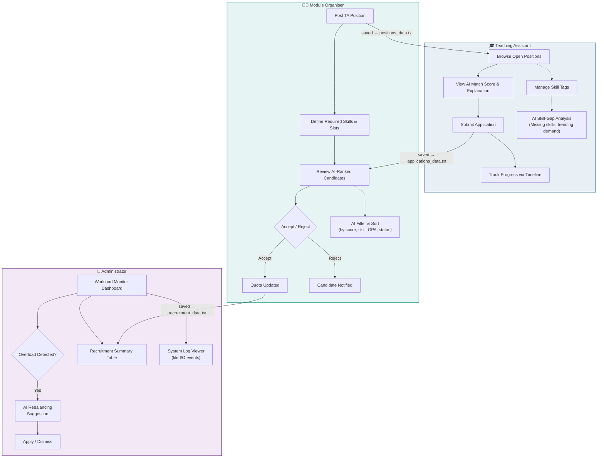
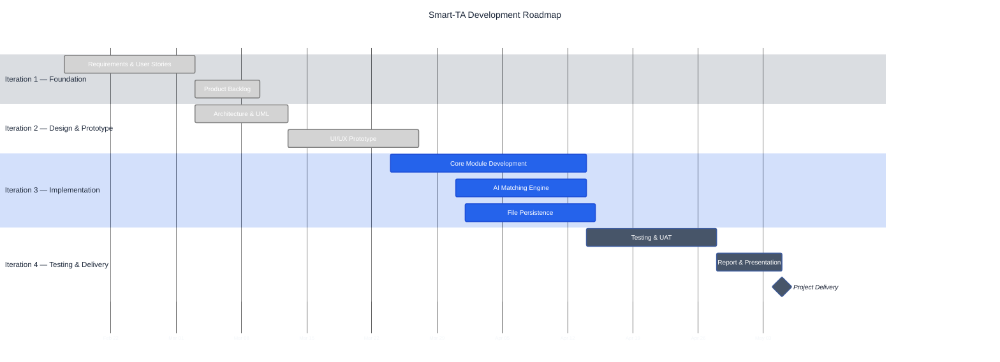

<div align="center">

# Smart-TA: AI-Powered Recruitment for BUPT

**Streamlining Teaching Assistant recruitment with intelligent matching, role-based workflows, and zero-database persistence.**

[](#)
[](#)
[](#)
[](#)
[](#)
[](#)

<br/>

> _"Replacing scattered emails and opaque selection with a single, intelligent platform."_

</div>

---

## Table of Contents

- [Project Overview](#-project-overview)
- [Key Features](#-key-features)
- [System Architecture](#-system-architecture)
- [Technical Stack](#-technical-stack)
- [Quick Start](#-quick-start)
- [Prototype Walkthrough](#-prototype-walkthrough)
- [Roadmap & Agile Process](#-roadmap--agile-process)
- [Repository Structure](#-repository-structure)
- [Team](#-team)
- [License](#-license)

---

## 📖 Project Overview

Traditional Teaching Assistant (TA) recruitment at BUPT suffers from fragmented communication, manual spreadsheet tracking, and a lack of transparency for all stakeholders. **Smart-TA** is a full-stack system design project that reimagines this process through three core principles:

| Principle | Description |
|-----------|-------------|
| **Role-Based Clarity** | Dedicated dashboards for TAs, Module Organisers (MOs), and Administrators — each seeing only what they need. |
| **AI-Assisted Decision-Making** | Composite matching scores that rank candidates by skill overlap, GPA relevance, and workload availability. |
| **No-Database Persistence** | All data is stored via flat-file I/O (`.txt` / `.csv`), satisfying the course constraint of operating without any SQL or NoSQL database. |

This repository contains the complete deliverables for **EBU6304 Software Engineering (2025–26 Spring)**, from requirements engineering and Agile backlog planning through interactive prototyping and system architecture design.

---

## ✨ Key Features

### 🎯 Intelligent Candidate Matching

Every applicant receives an **AI composite score** (0–100) computed from:
- **Skill Overlap** — percentage of required skills the candidate possesses
- **GPA Relevance** — weighted comparison against module-specific thresholds
- **Availability** — remaining weekly hours vs. the position requirement

Module Organisers can hover over any candidate's score to view a full **AI Explanation Tooltip**, ensuring the matching process is transparent and explainable.

### 📊 Real-Time Workload Monitoring

Administrators have a global **Workload Distribution Panel** that visualises every TA's committed hours against the 20-hour institutional cap. When a TA exceeds the limit, the system:
1. Flags the overload with a visual warning
2. Triggers an **AI Rebalancing Recommendation** suggesting optimal reassignments
3. Logs the event to `workload_alerts.txt`

### 🗂️ Zero-Database File Persistence

In compliance with the course's No-DB constraint, every write operation simulates persistence to named text files (`applications_data.txt`, `positions_data.txt`, `quota_data.txt`, etc.). The Admin panel includes:
- A **System Activity Log** viewer showing timestamped read/write events
- A **File Storage Status** dashboard reporting the health of each data file

---

## 🏗 System Architecture

The following diagram illustrates the end-to-end recruitment workflow across all three user roles:



---

## 🛠 Technical Stack

| Layer | Technology | Notes |
|-------|-----------|-------|
| **Frontend** | HTML5, CSS3 (Custom Properties), Vanilla JavaScript | Single-file prototype; no build tooling required |
| **Typography** | Google Fonts (DM Sans, Playfair Display) | Loaded via CDN for consistent cross-browser rendering |
| **Data Storage** | Flat-file simulation (`.txt`) | Simulated via UI feedback — no actual backend or database |
| **AI Engine** | Simulated composite scoring | Weighted formula: `0.4 × Skill + 0.3 × GPA + 0.3 × Availability` |
| **Design System** | CSS Custom Properties (Design Tokens) | 20+ tokens for colours, spacing, shadows, and typography |
| **Methodology** | Agile Scrum (4 iterations) | Product Backlog managed in structured format |

> **Why no database?** The EBU6304 course specification explicitly requires that the system operate under a **No-SQL/No-DB constraint**. All persistence is achieved through file-system I/O, which we simulate visually with save-progress bars and toast notifications referencing specific `.txt` data files.

---

## 🚀 Quick Start

### Prerequisites

- A modern web browser (Chrome, Firefox, Edge, or Safari)
- No server, package manager, or build tool required

### Run the Prototype

```bash
# 1. Clone the repository
git clone https://github.com/your-org/EBU6304-Group-37.git

# 2. Navigate into the project directory
cd EBU6304-Group-37

# 3. Open the prototype in your default browser
#    On macOS / Linux:
open Prototype_group37.html
#    On Windows:
start Prototype_group37.html
```

That's it — the entire prototype runs client-side with **zero dependencies**.

---

## 🖥 Prototype Walkthrough

The interactive prototype covers three role-based dashboards, each accessible via the top navigation bar:

### TA Dashboard

| Feature | Description |
|---------|-------------|
| **Available Positions** | Filterable job listing with AI match scores and hover-to-explain tooltips |
| **My Applications** | Visual timeline tracker showing each application's progress (Submitted → Review → Interview → Decision) |
| **Skill Management** | Add/remove skill tags interactively; changes trigger simulated file-save feedback |
| **AI Skill-Gap Analysis** | Sidebar panel highlighting missing skills and trending demand this semester |

### MO Portal

| Feature | Description |
|---------|-------------|
| **Post Position** | Complete form with skill input, hour selection, slot count, and deadline — publishes with animated save bar |
| **Review Applicants** | AI-ranked candidate table with composite score breakdown, filterable by score/status/skill |
| **Manage Quotas** | Visual slot management cards with +/- controls and fill-progress indicators |

### Admin Overview

| Feature | Description |
|---------|-------------|
| **Workload Monitor** | Horizontal bar chart of every TA's hours with colour-coded overload warnings |
| **Recruitment Summary** | Module-level table showing applicants, acceptances, and remaining slots |
| **System Logs** | Terminal-styled log viewer with INFO/WARN/ERROR entries referencing file I/O operations |
| **File Storage Status** | Grid showing health status of all simulated data files |

---

## 🗺 Roadmap & Agile Process

Development follows a four-iteration Agile Scrum cycle. Each iteration delivers a shippable increment:

Task labels in the chart are shortened so bars stay proportional; the **Iteration Highlights** table below lists the full deliverable names.



### Iteration Highlights

| Iteration | Focus | Key Deliverables |
|-----------|-------|-----------------|
| **1** | Foundation | Stakeholder analysis, user stories, acceptance criteria, prioritised Product Backlog |
| **2** | Design | System architecture, UML class/sequence diagrams, interactive HTML prototype |
| **3** | Implementation | Role-based modules, AI scoring engine, file I/O persistence, toast/modal UX |
| **4** | Delivery | Integration testing, user acceptance testing, final report, presentation |

---

## 📂 Repository Structure

```text
EBU6304-Group-37/
├── Prototype_group37.html   # Interactive UI prototype (open in browser)
├── Report_group37.docx      # System analysis & design report
└── README.md                # Project overview (you are here)
```

---

## 👥 Team

**Group 37** — EBU6304 Software Engineering, BUPT, Spring 2025–26

| Role | Responsibility |
|------|---------------|
| Product Owner | Requirements elicitation, backlog prioritisation |
| Scrum Master | Sprint planning, stand-ups, retrospectives |
| UI/UX Designer | Prototype design, usability heuristic evaluation |
| System Architect | UML modelling, component design, data flow |
| QA Engineer | Test planning, acceptance criteria verification |

---

## 📄 License

This project is licensed under the **MIT License** — see the [LICENSE](LICENSE) file for details.

---

<div align="center">

_Built with rigour and care for EBU6304 · Beijing University of Posts and Telecommunications_

**[⬆ Back to Top](#smart-ta-ai-powered-recruitment-for-bupt)**

</div>
